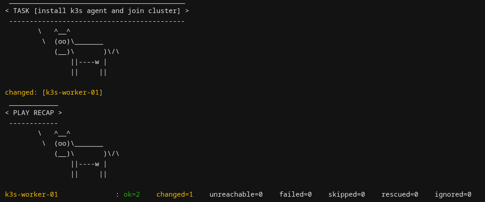
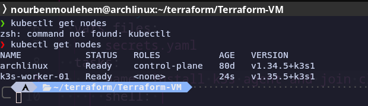

# k3s worker provisioning on Proxmox with Terraform + Ansible

Terraform clones a cloud-init template on my Proxmox node into a new VM,
and Ansible installs the k3s agent on it so it joins my existing k3s cluster
as a worker. The point was to provision everything by code.

I built the base template by hand first (cloud image -> import disk ->
cloud-init -> convert to template) to understand each step (I will use Packer for future version), then automated
the clone + provision with Terraform and Ansible for configuration management.

## What it does

1. Terraform clones template `9000` -> worker VM `101` with a static IP, resized disk, and cloud-init (user + SSH key)
2. Ansible SSHes into the worker and runs the k3s agent install, pointing it at my k3s server + join token
3. Worker joins the cluster — `kubectl get nodes` shows it as Ready

## Setup

- k3s cluster already running (in my case, on my desktop (Arch, btw), outside Proxmox)
- Terraform and Ansible installed on any machine in your lan
- A Proxmox API token 
- A cloud-init template already built on Proxmox (here: VMID 9000)


## Run

```bash
cd terraform
terraform init
terraform plan
terraform apply

cd ../ansible
ansible-playbook -i inventory.yaml playbook-k3s-worker.yaml --ask-vault-pass
```

you can override diffult values in terraform apply -var="template_id=9001"

playbook output:

final output:


## Note on the qemu-guest-agent

The stock Ubuntu cloud image doesn't have qemu-guest-agent running, so when
Terraform is set to wait for the agent (`agent { enabled = true }`) it hangs
until timeout even though the VM is fine. The proper fix is baking the agent into the template so every clone
has it.

## Future work

- Multiple workers + a count/variable for scaling
- Taint the control-plane so workloads land on workers
- Build the template itself with Packer instead of by hand


